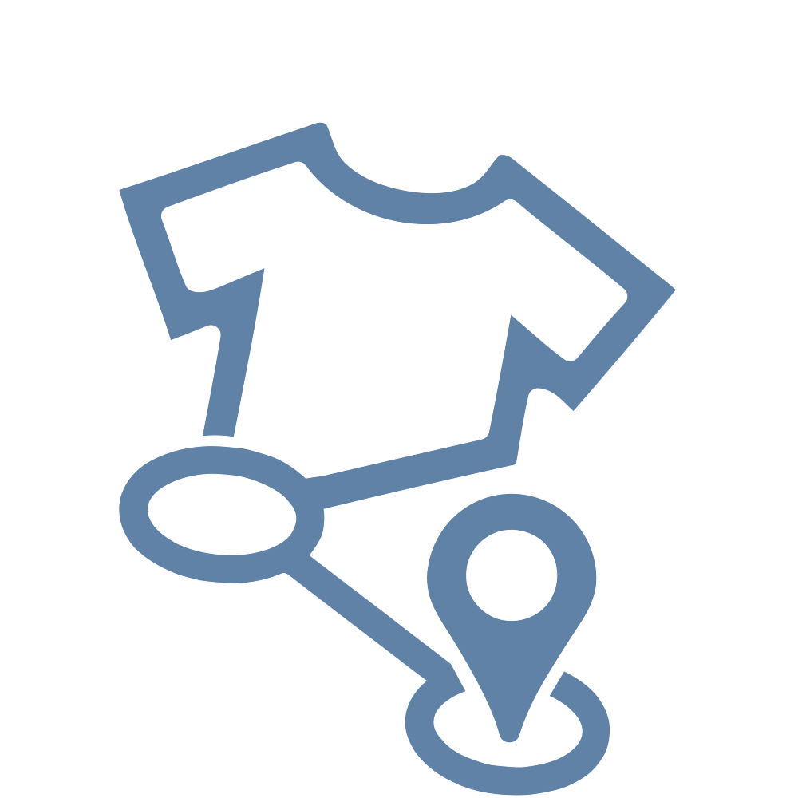

<h1 align="center">Thrift Notice 💸</h1>
<a id="readme-top"></a>

[![Contributors][contributors-shield]][contributors-url]
[![Forks][forks-shield]][forks-url]
[![Stargazers][stars-shield]][stars-url]
[![Issues][issues-shield]][issues-url]
[![project_license][license-shield]][license-url]
[![LinkedIn][linkedin-shield]][linkedin-url]

<!-- PROJECT LOGO -->
<div align="center">
  <a href="https://github.com/kiloumanjaro/ThriftNotice">
    
  </a>
  <br />
  <p align="center">
    <br />
    This is your notice to start thrifting!
    <br />
    <br />
    <p align="center">
      <a href="#"></a>
      <a href="https://www.figma.com/file/ViBW8GbUgkTMmK6a80h8X1/Read-You?node-id=7028%3A23673"></a>
      <a href="https://www.python.org"></a>
      <a href="https://github.com/kiloumanjaro/ThriftNotice/commits/main">
    </p>
    <a href="https://github.com/kiloumanjaro/ThriftNotice/issues/new?labels=bug&template=bug-report---.md">Report Bug</a>
    &middot;
    <a href="https://github.com/kiloumanjaro/ThriftNotice/issues/new?labels=enhancement&template=feature-request---.md">Request Feature</a>
  </p>
</div>

<!-- TABLE OF CONTENTS -->
<details>
  <summary>Table of Contents</summary>
  <ol>
    <li>
      <a href="#%EF%B8%8F-project-overview">🗺️ Project Overview</a>
      <ul>
        <li><a href="#-built-with">📚 Built With</a></li>
      </ul>
    </li>
    <li><a href="#-screenshots">📱 Screenshots</a></li>
    <li>
      <a href="#-getting-started">💻 Getting Started</a>
      <ul>
        <li><a href="#-prerequisites">🔧 Prerequisites</a></li>
        <li><a href="#%EF%B8%8F-installation">🛠️ Installation</a></li>
        <li><a href="#%EF%B8%8F-running-the-application">▶️ Running the Application</a></li>
      </ul>
    </li>
    <li><a href="#-notes">📝 Notes</a></li>
    <li><a href="#-contributing">📬 Contributing</a></li>
    <li><a href="#%EF%B8%8F-license">⚖️ License</a></li>
  </ol>
</details>

<!-- PROJECT OVERVIEW -->
## 🗺️ Project Overview

This project aims to develop an application that locates ukay-ukay/pop-ups by retrieving relevant location details from Google's API, and display them in a map using a geocoding API. It also uses AI to summarize reviews and match a user to a shop depending on their preference on certain categories related to thrifting.

### 📚 Built With

[![Python][Python]][Python-url]
[![Django][Django]][Django-url]
[![Supabase][Supabase]][Supabase-url]

<!-- SCREENSHOTS -->
## 📱 Screenshots & Features

Use this space to show useful examples of how a project can be used. Additional screenshots, code examples and demos work well in this space. You may also link to more resources.

_For more examples, please refer to the [Documentation](https://example.com)_

<!-- GETTING STARTED -->
## 💻 Getting Started

Follow these steps to get ThriftNotice running on your local machine.

### 🔧 Prerequisites

- Python 3.12 or higher
- Poetry (Python package manager)
- Git


### 🛠️ Installation

#### 1. Clone the Repository
```sh
git clone https://github.com/kiloumanjaro/ThriftNotice.git
cd ThriftNotice
```

#### 2. Install Dependencies with Poetry
```sh
# Install project dependencies
poetry install
```

#### 3. Environment Setup
```bash
# Copy the environment template
cp .env.example .env
```

Edit the `.env` file with your configuration (API keys, database URL, etc.)

#### 4. Database Setup

Create and activate a virtual environment:
```sh
# Create a virtual environment named "backend"
python -m venv backend

# On Windows:
backend\\Scripts\\activate

# On macOS/Linux:
source backend/bin/activate
```

Install backend dependencies:
```sh
pip install -r requirements.txt
```

Apply database migrations:
```sh
cd backend
python manage.py migrate
cd ..
```

### ▶️ Running the Application

#### Run the Frontend
```sh
cd frontend
poetry run flet run
```

#### Run the Backend
In a new terminal (or after stopping the frontend):
```sh
cd backend
python manage.py runserver
```

## 📝 Notes

- Make sure to run the backend and frontend in separate terminal windows if you want both running simultaneously
- The backend server typically runs on `http://127.0.0.1:8000/`
- Ensure your `.env` file is properly configured before running the application


<!-- CONTRIBUTING -->
## 📬 Contributing

If you have a suggestion that would make this better, please fork the repo and create a pull request. You can also simply open an issue with the tag "enhancement".
Don't forget to give the project a star! Thanks again!

1. Fork the Project
2. Create your Feature Branch (`git checkout -b feature/AmazingFeature`)
3. Commit your Changes (`git commit -m 'Add some AmazingFeature'`)
4. Push to the Branch (`git push origin feature/AmazingFeature`)
5. Open a Pull Request

### 📢 Contributors

<a href="https://github.com/kiloumanjaro/ThriftNotice/graphs/contributors">
  
</a>


<!-- LICENSE -->
## ⚖️ License

Distributed under the project_license. See `LICENSE.txt` for more information.

<!-- MARKDOWN LINKS & IMAGES -->
<!-- https://www.markdownguide.org/basic-syntax/#reference-style-links -->
[contributors-shield]: https://img.shields.io/github/contributors/kiloumanjaro/ThriftNotice.svg?style=for-the-badge
[contributors-url]: https://github.com/kiloumanjaro/ThriftNotice/graphs/contributors
[forks-shield]: https://img.shields.io/github/forks/kiloumanjaro/ThriftNotice.svg?style=for-the-badge
[forks-url]: https://github.com/kiloumanjaro/ThriftNotice/network/members
[stars-shield]: https://img.shields.io/github/stars/kiloumanjaro/ThriftNotice.svg?style=for-the-badge
[stars-url]: https://github.com/kiloumanjaro/ThriftNotice/stargazers
[issues-shield]: https://img.shields.io/github/issues/kiloumanjaro/ThriftNotice.svg?style=for-the-badge
[issues-url]: https://github.com/kiloumanjaro/ThriftNotice/issues
[license-shield]: https://img.shields.io/github/license/kiloumanjaro/ThriftNotice.svg?style=for-the-badge
[license-url]: https://github.com/kiloumanjaro/ThriftNotice/blob/master/LICENSE.txt
[linkedin-shield]: https://img.shields.io/badge/-LinkedIn-black.svg?style=for-the-badge&logo=linkedin&colorB=555
[linkedin-url]: https://linkedin.com/in/linkedin_username
[product-screenshot]: images/screenshot.png
[Python]: https://img.shields.io/badge/python-3670A0?style=for-the-badge&logo=python&logoColor=ffdd54
[Python-url]: https://www.python.org/
[Django]: https://img.shields.io/badge/Django-092E20?style=for-the-badge&logo=django&logoColor=green
[Django-url]: https://www.djangoproject.com/
[Supabase]: https://shields.io/badge/supabase-black?logo=supabase&style=for-the-badge
[Supabase-url]: https://supabase.com/
[Angular.io]: https://img.shields.io/badge/Angular-DD0031?style=for-the-badge&logo=angular&logoColor=white
[Angular-url]: https://angular.io/
[Svelte.dev]: https://img.shields.io/badge/Svelte-4A4A55?style=for-the-badge&logo=svelte&logoColor=FF3E00
[Svelte-url]: https://svelte.dev/
[Laravel.com]: https://img.shields.io/badge/Laravel-FF2D20?style=for-the-badge&logo=laravel&logoColor=white
[Laravel-url]: https://laravel.com
[Bootstrap.com]: https://img.shields.io/badge/Bootstrap-563D7C?style=for-the-badge&logo=bootstrap&logoColor=white
[Bootstrap-url]: https://getbootstrap.com
[JQuery.com]: https://img.shields.io/badge/jQuery-0769AD?style=for-the-badge&logo=jquery&logoColor=white
[JQuery-url]: https://jquery.com 
